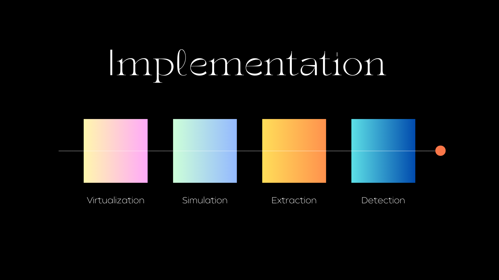
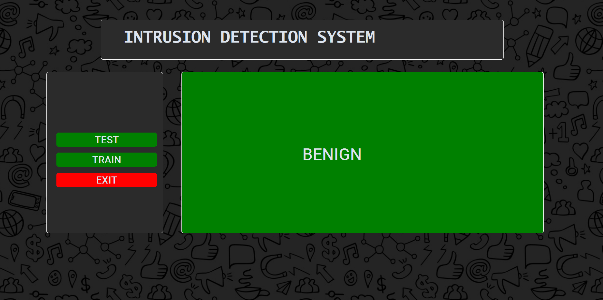
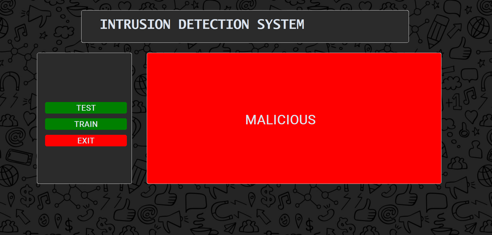

<h1 align="center">
  <br>
  <a href="http://www.amitmerchant.com/electron-markdownify"></a>
  <br>
Intrusion Detection System
  <br>
</h1>

<h4 align="center">An Intrusion detection system designed for  <a href="https://en.wikipedia.org/wiki/Anomaly-based_intrusion_detection_system" target="_blank">Anomaly-based attacks</a>.</h4>


<br>
<br>


> **Note**
> * This project represents a `research` initiative recognized within the IEEE Access and also has been developed as functional software. 

> * The `research paper` associated with this project has undergone a thorough review and has been accepted for publication in `IEEE`. It will soon be published within the academic community.

> * Some of the features have not been discussed due to privacy and  restrictions policies.

<br>
<p align="center">
  
</p>


## Introduction 

To explain the research in a manner accessible to a broad audience, it introduces a practical remedy for addressing the intricacies associated with uncommon cyber threats. This undertaking empowers both cybersecurity professionals and everyday users through the provision of software designed to swiftly and accurately scrutinize individual or clusters of network data in real-time, facilitating the identification of potential security risks.


## Key Features

* This intrusion detection system does an in-depth analysis of the following malicious packets through which attacks are performed:
    - Brute force attack
    - Heartbleed attack
    - Botnet attack
    - DDoS and DoS attack
    - Web attack
    - Infiltration attack


* It has better classification accuracy rate.

* It provides you with much more functions for analyzing the packets.

* It is also trained on self-attained dataset .

* It has an User interface for analyzing and classifying packets.


## Theory

The following image provides an overview of the flow and implementation of work:
<p align = "center">
    </a>
</p>

This system's processing methodology steps: 
* Extraction: 
  - First, individual live packets or a specific packet set are extracted from Wireshark, and subsequently, they are saved in a packet capture file format (.Pcap).
<br/>

* Conversion: 
  - These .Pcap files under transformation into .csv extension files using the CIC-flowmeter tool. This conversion process optimizes the data format for subsequent analysis. 
<br/>

* Detection: 
  - Subsequently, the transformed csv files serve as input for the Intrusion Detection system. This system undertakes a pivotal role in determining the nature of each individual data packet, classifying them as malicious or non-malicious based on their attributes. 


## Virtualization
We simulated different types of malicious attacks by using virtualization. This gave us a safe environment which isolated the host OS and real world network connection.

2 types of virtual OS were used:

* Kali linux (Attacker machine) 
* Ubuntu (Victim machine)

## Simulation

`Hping3` is harnessed to execute flood attacks on the designated victim system. The purpose behind utilizing this tool revolves around generating and transmitting manipulated packets. The intention between this is twofold: to exert an overwhelming strain on the target system's resources and, additionally, to exploit potential weaknesses in its defences.

```bash

# Simulate a SYN flood attack on the victim's system
$ Hping3 -S –flood -p 80 –rand-source IP
```

## Dataset

The dataset used in this scenario is `CICIDS-2017` with a mixture of some live generated data through simulation. 

* Normal dataset on which the dataset is trained on could be downloaded through kaggle. [Dataset](https://www.kaggle.com/datasets/cicdataset/cicids2017)

> **Note**
> The dataset has not been uploaded due to privacy reasons as well as restricted institutional policies. 


## CIC-Flowmeter

`CIC-flowmeter` has been used to extract network packets into extra parameters defined by the the dataset. It generates 84 network traffic features by reading pcap files. It acts as a parser in this process. 

> **Note**
>  For citation and also understanding CICFlowMeter (formerly ISCXFlowMeter) completely, you can find below published papers:
> * Arash Habibi Lashkari, Gerard Draper-Gil, Mohammad Saiful Islam Mamun and Ali A. Ghorbani, "Characterization of Tor Traffic Using Time Based Features", In the proceeding of the 3rd International Conference on Information System Security and Privacy, SCITEPRESS, Porto, Portugal, 2017.
> * Gerard Drapper Gil, Arash Habibi Lashkari, Mohammad Mamun, Ali A. Ghorbani, "Characterization of Encrypted and VPN Traffic Using Time-Related Features", In Proceedings of the 2nd International Conference on Information Systems Security and Privacy(ICISSP 2016) , pages 407-414, Rome , Italy.

## RESULTS

The first image provides the result for `Benign` network packet.
<p align="center">
</p>
 

The second image provides the result for `Malicious` network packet.
<p align="center">
</p>

## Software Usage

* Anaconda Spyder (IDE)
* CustomTkinter (user Interface)
* CIC-Flowmeter (parser)
* VM VirtualBox (Virtualization)
* Operating System
    - Windows 11 (Core OS)
    - Kali Linux (Virtualized Attacker OS)
    - Ubuntu (Virtualized Victim OS)
